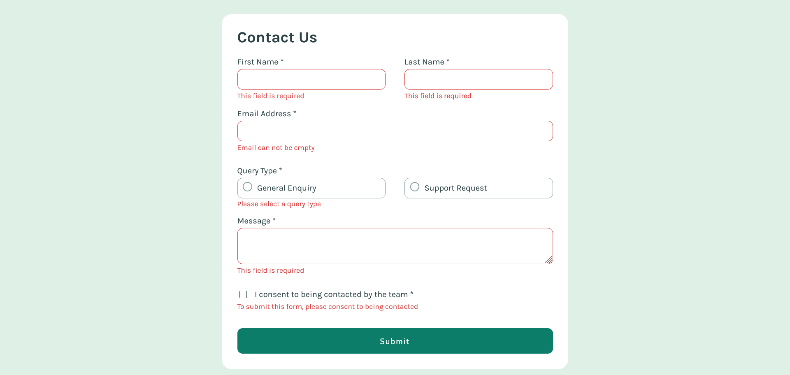

# Frontend Mentor - Contact Form Solution

This is my solution to the [Contact form challenge on Frontend Mentor](https://www.frontendmentor.io/challenges/contact-form--G-hYlqKJj). I worked on this project to enhance my HTML, CSS, and JavaScript skills, with a particular focus on accessibility and responsiveness.

---

## Table of Contents

- [Frontend Mentor - Contact Form Solution](#frontend-mentor---contact-form-solution)
  - [Table of Contents](#table-of-contents)
  - [Overview](#overview)
    - [The Challenge](#the-challenge)
    - [Screenshots](#screenshots)
      - [Desktop View](#desktop-view)
      - [Error Handling](#error-handling)
      - [Mobile View](#mobile-view)
      - [Success Message](#success-message)
    - [Links](#links)
  - [My Process](#my-process)
    - [Built With](#built-with)
    - [Challenges Faced](#challenges-faced)
    - [What I Learned](#what-i-learned)
  - [Author](#author)

---

## Overview

### The Challenge

Users should be able to:

- Complete the form and see a success message after submission.
- Receive validation messages for missing or invalid fields.
- Navigate and complete the form using only the keyboard.
- Have errors and success messages announced by screen readers.
- View the form’s optimal layout on all devices.
- See hover and focus states for interactive elements.

### Screenshots

#### Desktop View

#### Error Handling

#### Mobile View

#### Success Message

### Links

- [Solution URL](https://github.com/your-repo-url)
- [Live Site URL](https://your-live-site-url.netlify.app)

---

## My Process

### Built With

- Semantic **HTML5**
- **CSS** with custom properties
- Flexbox for layout
- Desktop-first workflow
- Vanilla **JavaScript**

### Challenges Faced

1. **Accessibility:**  
   Making the form fully accessible was new for me. Adding attributes like `aria-live` and ensuring screen readers could announce errors and success messages was challenging but valuable. It showed me the importance of inclusive design.
   
2. **Validation:**  
   Custom validation for required fields, email formats, and radio buttons was another challenge. It was rewarding to see the final result, but I plan to refactor the code in future projects for better readability and efficiency.
   
3. **Styling Inputs, Radio Buttons, and Checkboxes:**  
   Creating custom styles for the inputs, particularly the radio buttons and checkboxes, was quite challenging. Using pseudo-elements like `::before` and `::after` to achieve the desired design while maintaining accessibility required a lot of trial and error. I’m happy with the final look but will explore more efficient techniques in future projects.

4. **Responsiveness:**  
   Designing a form that works seamlessly across devices involved a lot of testing and tweaking. I’m proud of the result, but I want to simplify my responsive design process in future projects.

### What I Learned

- How to make forms accessible for keyboard users and screen readers.
- Using `aria-live` to make error and success messages accessible.
- Handling form validation with JavaScript to improve the user experience.

---

## Author

- Frontend Mentor - [@yourusername](https://www.frontendmentor.io/profile/yourusername)
- LinkedIn - [Your Name](https://www.linkedin.com/in/your-profile/)

---

